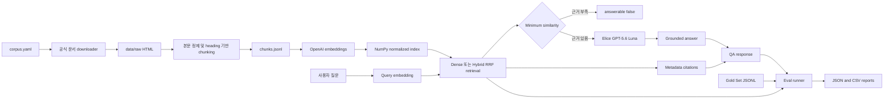

# Kubernetes Citation RAG

Kubernetes 공식 영문 문서를 근거로 답하고 citation을 반환하는 작은 RAG 프로젝트입니다. 목표는 애플리케이션 기능을 늘리는 것보다 검색 품질과 답변 품질을 분리해 평가하고, dense baseline과 BM25+dense hybrid를 동일한 gold set으로 비교하는 것입니다.

현재 Part A의 dense baseline과 Part B의 평가 하네스가 구현되어 있습니다. API 키가 없어도 앱 import, `/health`, 평가 CLI 도움말, 설정 파싱, 단위 테스트가 동작합니다. `/retrieve`와 `/qa`는 인덱스가 준비될 때까지 HTTP 503을 반환합니다.

## 기술 구성

- Python 3.11+, FastAPI, Uvicorn
- Elice Cloud ML API의 OpenAI 호환 LLM endpoint
- OpenAI `text-embedding-3-small`
- NumPy cosine similarity baseline, `rank-bm25` hybrid experiment
- YAML configuration, JSONL gold set, JSON/CSV reports

### 기술 선택 근거

| 선택 | 이유 | 감수한 trade-off |
|---|---|---|
| Kubernetes 공식 영문 문서 30개 | 출처가 명확하고 운영·트러블슈팅 질문을 만들기 쉬우며 citation을 URL로 검증할 수 있다. | 한국어 질문과 영문 문서 사이의 언어 불일치가 sparse retrieval에 불리하다. |
| Elice GPT-5.6 Luna | 과제에서 제공한 ML API 크레딧과 OpenAI 호환 호출 방식을 활용할 수 있다. | 제공자 장애나 rate limit이 전체 생성 평가에 영향을 줄 수 있다. |
| OpenAI `text-embedding-3-small` | 작은 corpus에서 비용과 검색 품질의 균형이 좋고 API 사용이 단순하다. | 외부 API 의존성이 있으며 query embedding도 호출 비용이 발생한다. |
| NumPy 로컬 인덱스 | 약 30개 문서 규모에서는 충분하고 cosine 계산이 코드에 그대로 드러난다. | 대규모 corpus의 증분 갱신, 필터링, 분산 검색에는 적합하지 않다. |
| FastAPI와 명시적인 Python 함수 | Request/Response schema와 검색·생성 흐름을 작은 코드베이스에서 확인하기 쉽다. | 프레임워크가 제공하는 복잡한 RAG orchestration 기능을 직접 구현해야 한다. |

## 설치 (`uv`)

Python과 의존성은 `uv`로 고정합니다. 저장소 루트에서 다음 한 명령을 실행하면 `.python-version`, `pyproject.toml`, `uv.lock`을 기준으로 `.venv`가 준비됩니다.

Windows PowerShell, macOS, Linux 공통:

```powershell
uv sync
```

가상환경을 직접 활성화하지 않고 아래처럼 실행할 수 있습니다.

```powershell
uv run python -m pytest
uv run uvicorn app.main:app --reload
```

`requirements.txt`는 과제 제출 및 일반 `pip` 환경과의 호환을 위해 함께 유지하지만, 이 저장소의 기준 패키지 관리는 `pyproject.toml`과 `uv.lock`입니다.

로컬 전용 `.env` 파일은 이미 생성되어 있고 Git에서 제외됩니다. 다음 값을 실제 발급 정보로 채웁니다.

```dotenv
ELICE_API_KEY=
ELICE_BASE_URL=
ELICE_LLM_MODEL=openai/gpt-5.6-luna
OPENAI_API_KEY=
OPENAI_EMBEDDING_MODEL=text-embedding-3-small
RAG_SEED=42
```

## 빠른 확인

```powershell
uv run python -c "from app.main import app; print(app.title)"
uv run python -m eval.run_eval --help
uv run python -m pytest
uv run uvicorn app.main:app --reload
```

서버 실행 후 `GET http://127.0.0.1:8000/health`에서 API 설정과 인덱스 준비 상태를 확인할 수 있습니다.

## 시스템 아키텍처



실행 경로는 다운로드, 정제, 임베딩, 검색, 답변 생성, 평가로 분리되어 있습니다. LLM은 검색된 context만 받아 답변하고, citation URL은 LLM 문자열에서 파싱하지 않고 검색 결과 metadata에서 조립합니다.

## Part A: baseline 구축

아래 명령을 순서대로 실행합니다. 다운로드는 `config/corpus.yaml`의 Kubernetes 공식 URL 30개만 허용하고, 원문 HTML·청크·벡터 인덱스를 단계별로 저장합니다.

```powershell
uv run python scripts/download_corpus.py
uv run python -m rag.ingest
uv run python -m rag.index
uv run uvicorn app.main:app --reload
```

질의 API는 검색 결과가 임계값보다 낮으면 답을 생성하지 않고 `insufficient_evidence`를 반환합니다. 답변 citation의 URL과 제목은 모델 출력이 아니라 검색 청크의 metadata에서 만듭니다.

### Corpus 선정과 chunking 근거

공개 문서셋 유형 중 Kubernetes 공식 문서를 선택했습니다. Kubernetes는 workload, scheduling, networking, configuration, troubleshooting처럼 서로 관련되지만 구분 가능한 주제를 제공하므로 단순 사실 질문뿐 아니라 비교·추론·장애 대응 질문을 평가할 수 있습니다. 공식 문서 URL allowlist를 사용해 출처 범위를 통제하고, 원문을 저장소에 직접 포함하지 않아도 다운로드 스크립트로 같은 corpus를 재구성할 수 있게 했습니다.

Baseline은 HTML의 `main` 또는 `article` 본문에서 navigation, script, form 등을 제거한 뒤 `h1`~`h3` heading을 section metadata로 보존합니다. 각 section을 800자, 100자 overlap으로 자릅니다. 이 방식은 단순하고 재현 가능하지만 문장·의미 경계를 항상 보존하지는 않으므로 이후 실험 후보로 semantic chunking을 남겨둡니다.

### API

| Method | Path | 역할 |
|---|---|---|
| `GET` | `/health` | API 설정과 로컬 인덱스 준비 상태 확인 |
| `POST` | `/retrieve` | Top-K chunk, cosine score, citation metadata 반환 |
| `POST` | `/qa` | 근거 충분성 판정 후 답변과 metadata citation 반환 |

## Part B: 평가 하네스

```powershell
uv run python -m eval.run_eval --config config/baseline.yaml --retrieval-only --output-name baseline-retrieval
uv run python -m eval.run_eval --config config/baseline.yaml --output-name baseline-full
```

Gold set은 사실·비교·요약·추론·트러블슈팅·답변 불가 유형 28문항입니다. Recall@K, MRR, Answerable Accuracy, Citation Accuracy를 검색/생성 단계로 분리해 기록합니다. 한 질문의 실패가 전체 실행을 중단하지 않으며 설정, seed, 모델명, 사용량과 실행 시각을 JSON/CSV 결과에 남깁니다.

`--retrieval-only`는 Elice LLM을 호출하지 않으므로 검색 실험을 빠르게 반복할 때 사용합니다. 전체 평가는 답변과 citation까지 검사하므로 API 사용량이 발생합니다.

### Gold Set 구축 방식과 편향

Gold Set은 선택한 공식 문서를 읽고 직접 작성한 28문항으로 구성했습니다. 각 행에는 질문 유형, 기대 문서 ID, 수용 기준, 답변 가능 여부를 기록했습니다. 단순 사실형뿐 아니라 비교, 요약, 복합 추론, 트러블슈팅, corpus 밖의 답변 불가 질문을 포함했습니다. 개선 결과를 본 뒤 유리한 문항만 고르는 것을 막기 위해 baseline과 hybrid에서 같은 질문과 기대 문서를 고정했습니다.

이 데이터셋은 실제 서비스 로그에서 표집한 것이 아니므로 사용자의 실제 질문 분포를 대표하지 않습니다. 작성자가 선택한 문서와 표현에 편향되어 있고, 한국어 질문에 Kubernetes 영문 용어가 포함되는 정도가 BM25 성능에 직접 영향을 줍니다. 28문항은 회귀 탐지에는 유용하지만 일반화된 품질을 주장하기에는 작습니다.

### Metric 정의와 한계

| Metric | 평가 대상 | 계산과 선정 이유 | 한계 |
|---|---|---|---|
| Recall@5 | Retrieval | 기대 문서 중 Top-5에 포함된 비율. 필요한 근거를 검색 단계가 놓치는지 확인한다. | 문서 단위라 정확한 evidence chunk의 적합성을 보장하지 않는다. |
| MRR | Retrieval | 첫 기대 문서 순위의 역수. 생성 모델에 중요한 근거가 얼마나 앞에 오는지 본다. | 두 번째 이후의 관련 문서 품질은 거의 반영하지 않는다. |
| Answerable Accuracy | Retrieval/Generation gate | Gold의 답변 가능 여부와 threshold 판정이 같은 비율이다. | 소수의 unanswerable 문항 때문에 값이 크게 움직일 수 있다. |
| Citation Accuracy | Generation | 답변 가능한 문항은 기대 문서가 citation에 하나 이상 포함됐는지, 답변 불가 문항은 citation이 비었는지 확인한다. | 인용 precision, claim-level entailment, section 정확성은 측정하지 않는다. |
| Criteria Coverage | Generation | 수용 기준별 대체 핵심어가 답변에 나타난 비율이다. | 문자열 포함 기반이라 동의어를 놓치거나 문맥상 틀린 표현을 통과시킬 수 있다. |

LLM-as-a-Judge는 현재 baseline metric에 포함하지 않았습니다. Judge 자체의 prompt 민감도, 반복 일관성, human alignment를 별도로 검증하지 않은 상태에서 단일 모델 점수를 정답처럼 사용하지 않기 위해서입니다.

### 평가 산출물 정리 규칙

| 위치 | 용도 | 보존 내용 |
|---|---|---|
| `reports/<run-name>.json` | 감사 가능한 원본 결과 | 실행 시각, 모델·설정·seed, 질문별 검색 결과·답변·citation·metric·token usage·오류 |
| `reports/<run-name>.csv` | 빠른 비교와 그래프 입력 | 질문 ID·유형과 주요 metric, 오류 |
| `experiments/*-comparison.md` | 두 실행의 고정 비교 | 가설, 절대 점수, delta, 개선·회귀 문항, 해석 |
| `README.md` | 제출자가 처음 읽는 최종 요약 | 재현 방법, 설계 근거, 대표 결과, 한계, 후속 과제 |

새 실험은 기존 JSON/CSV를 덮어쓰지 않고 고유한 `--output-name`으로 저장합니다. 비교 전에는 Gold 문항·기대 문서, metric 정의, embedding/LLM 모델, Top-K, threshold, local seed가 같은지 확인합니다. 오류 문항을 제외해 계산되는 metric은 유효 분모를 함께 확인합니다.

### CI 회귀 방지 설계

외부 API를 mock한 단위 테스트는 모든 변경에서 실행하고, 고정된 작은 fixture index로 metric 공식을 검증합니다. 실제 API를 사용하는 전체 Eval은 비용과 provider 변동성이 있으므로 수동 또는 예약 workflow로 분리합니다. CI에서는 baseline JSON을 기준 artifact로 보존하고 Recall@5·MRR·Answerable Accuracy의 허용 하락폭과 오류 수 증가를 검사하되, threshold 변경이나 Gold Set 변경은 새 experiment version으로 명시합니다.

## Part C: 개선 실험

Fixed chunking + dense Top-K baseline 결과를 먼저 저장한 뒤 BM25와 dense 순위를 RRF로 결합합니다. 같은 gold set과 평가 설정을 사용하고 `experiments/`와 `reports/`에 Before/After 결과를 보존합니다. baseline 결과가 없는 상태에서는 개선 코드를 먼저 맞추지 않습니다.

```powershell
uv run python -m eval.run_eval --config config/hybrid.yaml --retrieval-only --output-name hybrid-retrieval
uv run python experiments/compare_results.py reports/baseline-retrieval.json reports/hybrid-retrieval.json
```

### Hypothesis

Dense retrieval에 Kubernetes 고유 명칭의 exact-term 신호를 제공하는 BM25를 0.2 가중치로 결합하고, dense 결과 0.8과 RRF로 합치면 관련 문서가 상위 순위로 이동해 MRR이 상승할 것으로 예상했습니다. 한국어 자연어 의미 유사도는 dense가 담당하고, 영문 리소스명·필드명은 BM25가 보완한다는 가설입니다.

### Result

Baseline과 hybrid는 동일한 28문항, `text-embedding-3-small`, GPT-5.6 Luna, Top-K 5, minimum similarity 0.30, local seed 42를 사용했습니다.

| Metric | Dense full | Hybrid full | Delta |
|---|---:|---:|---:|
| Recall@5 | 0.9487 | 0.9295 | -0.0192 |
| MRR | 0.8462 | 0.9038 | +0.0577 |
| Answerable Accuracy | 0.9286 | 0.9643 | +0.0357 |
| Citation Accuracy | 0.9259 | 0.9286 | +0.0026 |
| Criteria Coverage | 0.8974 | 0.8859 | -0.0115 |
| Error count | 1 | 0 | -1 |

Retrieval-only 실행도 Recall@5, MRR, Answerable Accuracy에서 같은 값을 보였고 두 실행 모두 오류가 없었습니다. 따라서 검색 metric 변화는 generation provider 오류와 분리해 확인할 수 있습니다.

| 질문 유형 | Dense Recall@5 | Hybrid Recall@5 | Dense MRR | Hybrid MRR | 관찰 |
|---|---:|---:|---:|---:|---|
| Comparison | 1.0000 | 1.0000 | 0.8571 | 0.8571 | 변화 없음 |
| Fact | 1.0000 | 1.0000 | 1.0000 | 1.0000 | 변화 없음 |
| Reasoning | 0.8571 | 0.7857 | 0.7143 | 0.7857 | 첫 관련 문서 순위는 개선됐지만 다중 근거 recall은 하락 |
| Summary | 1.0000 | 1.0000 | 1.0000 | 1.0000 | 변화 없음 |
| Troubleshooting | 0.9333 | 0.9333 | 0.8000 | 1.0000 | 상위 순위 개선 |

### Analysis

관찰된 결과로는 q004, q005, q025에서 첫 기대 문서 순위가 올라 MRR이 개선됐습니다. 반면 reasoning 유형 q026에서는 기대 문서 하나가 Top-5 밖으로 밀려 Recall@5가 0.5 하락했습니다. Hybrid는 “첫 번째 쓸 만한 근거를 앞에 배치”하는 목표에는 효과가 있었지만, 여러 문서를 함께 찾아야 하는 질문에는 candidate 결합 가중치가 충분히 균형적이지 않았습니다.

Generation에서는 q002와 q004의 criteria coverage가 개선됐지만 q016과 q020은 각각 0.5 하락했습니다. q028은 corpus 밖의 AWS EKS 비용 질문입니다. Dense full은 Elice endpoint 앞단의 Cloudflare 차단으로 오류가 발생했고, hybrid는 similarity threshold 아래에서 먼저 abstain해 외부 호출 없이 정답 처리했습니다. 이 차이 때문에 full 실행의 Citation Accuracy와 Criteria Coverage는 유효 분모가 같지 않아 작은 delta를 모델 품질 향상으로 단정할 수 없습니다.

해석상 BM25는 질문에 영문 Kubernetes 용어가 있을 때 기여하지만, 한국어 표현 자체는 sparse token overlap을 거의 만들지 못합니다. 또한 현재 citation metric은 기대 문서 하나만 포함해도 성공하므로, 높은 Citation Accuracy가 모든 주장에 정확한 근거가 붙었다는 의미는 아닙니다.

### Next Steps

1. q026의 dense/BM25 rank와 RRF contribution을 확인하고 `dense_weight`, `bm25_weight`, `candidate_k`를 별도 실험으로 조정합니다.
2. 한국어 query translation 또는 multilingual sparse retrieval을 적용하되 동일 Gold Set으로 새 버전을 측정합니다.
3. exact evidence chunk 또는 claim-level citation 평가를 추가해 문서 단위 Citation Accuracy의 맹점을 보완합니다.
4. unanswerable 질문을 늘리고 threshold sweep을 수행해 Answerable Accuracy의 표본 민감도를 낮춥니다.
5. 같은 오류 조건 또는 성공한 공통 문항만으로 generation metric을 다시 비교해 provider 오류의 영향을 분리합니다.

## 핵심 Design Decision과 Trade-off

| 결정 | 선택 이유 | 한계와 대안 |
|---|---|---|
| Heading을 보존한 고정 길이 chunk | 구현과 재현이 단순하고 section citation을 제공할 수 있다. | 의미 단위가 잘릴 수 있어 semantic/structure-aware chunking 실험이 필요하다. |
| 정규화 벡터의 NumPy 내적 | cosine similarity 공식과 점수가 코드에 드러나며 작은 corpus에 충분하다. | corpus가 커지면 FAISS나 vector database가 필요하다. |
| Top-1 similarity threshold로 abstention | 근거 부족 시 LLM 호출과 hallucination을 함께 줄인다. | Top-1만으로 복합 질문의 전체 근거 충분성을 판단하기 어렵다. |
| Citation을 retrieved metadata에서 조립 | 모델이 URL을 만들어내는 경로를 차단한다. | 검색된 문서가 실제 답변 claim을 뒷받침하는지는 별도 metric이 필요하다. |
| Retrieval-only와 full eval 분리 | 검색 회귀를 생성 모델·provider 변동과 분리한다. | 최종 사용자 품질은 full eval과 사람 검토를 함께 봐야 한다. |
| Dense 0.8 + BM25 0.2 RRF | 최소 변경으로 lexical 신호의 효과를 검증한다. | 가중치가 현재 작은 Gold Set에 종속될 수 있고 한국어 query에는 BM25 신호가 약하다. |
| `temperature=0`, `reasoning_effort=none`, local seed 기록 | 비용과 변동을 줄이고 설정 재현성을 높인다. | 원격 모델은 완전한 결정성을 보장하지 않으며 seed를 Luna에 보내지 않는다. |

## 현재 한계

- 30개 문서와 28개 수동 질문은 실제 사용자 분포를 대표하지 않습니다.
- 외부 embedding/LLM API의 가용성, rate limit, 모델 업데이트가 결과에 영향을 줄 수 있습니다.
- 기준 threshold 0.30은 더 큰 validation set으로 calibration되지 않았습니다.
- Criteria Coverage는 핵심어 문자열 기반이며 의미적 정답성을 완전히 측정하지 못합니다.
- Citation Accuracy는 claim-level entailment나 잘못된 추가 citation을 벌점 처리하지 않습니다.
- BM25 tokenization은 영문·숫자 중심이라 한국어 query translation 없이 sparse 신호가 제한적입니다.
- 로컬 NumPy index는 문서 변경 감지, 증분 갱신, 동시성, 대규모 검색을 지원하지 않습니다.
- 현재 API는 streaming을 지원하지 않습니다. 과제 핵심인 Eval과 개선 실험 이후의 선택 과제로 남깁니다.

## 폴더

```text
app/          FastAPI endpoint와 API 입출력 schema
rag/          ingest, index, retrieval, generation, citation
eval/         명시적인 metric 공식과 평가 실행기
scripts/      allowlist corpus downloader
config/       corpus 목록과 재현 가능한 실행 설정
data/         raw HTML, chunks, local index, gold set
experiments/  실험별 설정과 산출물
reports/      JSON/CSV 평가 결과
tests/        외부 API 없이 실행되는 smoke test
```

핵심 파이프라인은 LangChain/LlamaIndex, service/repository 계층, 범용 `utils.py` 없이 단순 함수와 명시적인 데이터 흐름으로 유지합니다.

## Gold set의 한계

현재 정답 문서와 수용 기준은 프로젝트 작성자가 공식 문서를 읽고 만든 소규모 수동 데이터입니다. 따라서 실제 사용자 질문 분포를 대표하지 않고, 문서 선택 편향과 표현 편향이 있습니다. 개선 실험에서는 같은 28문항을 고정해 비교 가능성을 확보하되, 최종 결론에는 이 한계를 함께 기록합니다.
